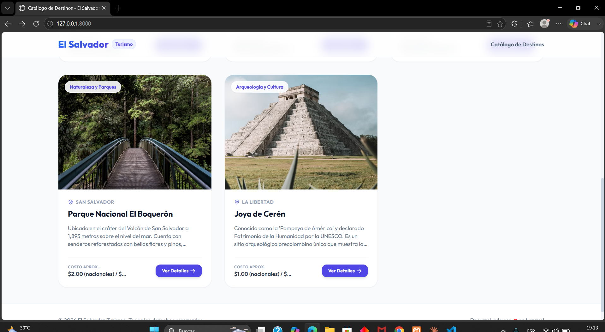
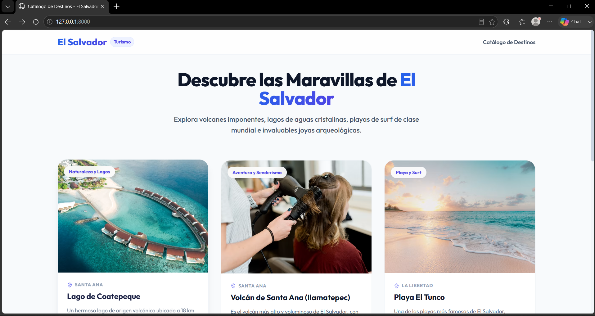
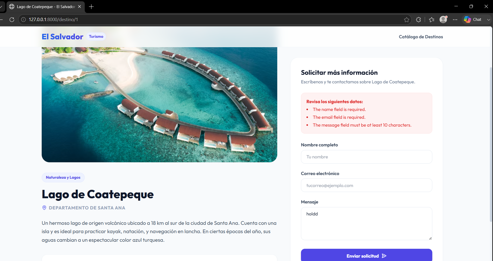
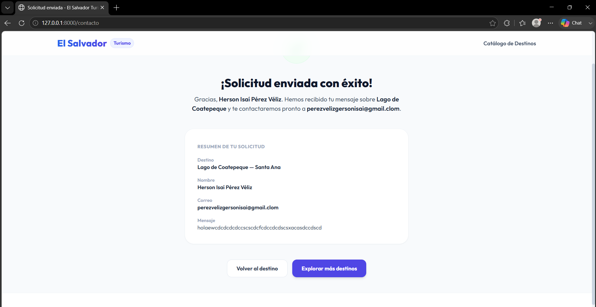

# Catálogo de Turismo de El Salvador — Laravel (Patrón MVC)

Aplicación web desarrollada en **Laravel** que implementa el patrón arquitectónico **MVC** (Modelo–Vista–Controlador) para mostrar un catálogo de lugares turísticos de El Salvador. Los datos se obtienen desde un **archivo JSON** (`database/data/tourist_sites.json`), sin uso de base de datos.

## 📋 Funcionalidades

- Listado de destinos turísticos disponibles.
- Vista de detalle de cada destino (título, departamento, categoría, precio y descripción).
- Formulario de contacto para solicitar más información sobre un destino, con validación de datos.

## 🛠️ Requisitos previos

- PHP >= 8.2
- Composer
- Node.js y NPM (opcional, solo si se desea compilar assets con Vite)

## 🚀 Instrucciones de instalación

1. Clonar el repositorio:
   ```bash
   git clone <URL-del-repositorio>
   cd catalog-turismo
   ```

2. Instalar las dependencias de PHP:
   ```bash
   composer install
   ```

3. Copiar el archivo de entorno y generar la clave de la aplicación:
   ```bash
   cp .env.example .env
   php artisan key:generate
   ```

4. (Opcional) Instalar dependencias de frontend:
   ```bash
   npm install
   npm run build
   ```

5. Levantar el servidor de desarrollo:
   ```bash
   php artisan serve
   ```

6. Abrir en el navegador:
   ```
   http://127.0.0.1:8000
   ```

No se requiere configurar base de datos ni ejecutar migraciones: la fuente de datos es el archivo JSON ubicado en `database/data/tourist_sites.json`.

## 🔄 Descripción del flujo MVC implementado

El ciclo de vida de una petición HTTP en este proyecto sigue estos pasos:

1. **Ruta (`routes/web.php`)**: define los endpoints de la aplicación y los asocia a un método del controlador.
   - `GET /` → `TouristSiteController@index` (listado)
   - `GET /destino/{id}` → `TouristSiteController@show` (detalle)
   - `POST /contacto` → `TouristSiteController@submitContact` (procesa el formulario)

2. **Controlador (`app/Http/Controllers/TouristSiteController.php`)**: recibe la petición, solicita los datos al modelo, valida la información entrante (en el caso del formulario de contacto) y decide qué vista retornar junto con los datos necesarios.

3. **Modelo (`app/Models/TouristSite.php`)**: encapsula el acceso a los datos. En lugar de consultar una base de datos mediante Eloquent, lee y decodifica el archivo `tourist_sites.json`, exponiendo métodos como `all()` y `find($id)`.

4. **Vista (`resources/views/tourist_sites/*.blade.php`)**: recibe los datos ya procesados por el controlador y los renderiza en HTML mediante Blade, sin contener lógica de negocio.

**Flujo de datos de un caso concreto (solicitar información de un destino):**

```
Usuario llena el formulario en show.blade.php
        │  (POST /contacto)
        ▼
routes/web.php enruta la petición
        │
        ▼
TouristSiteController@submitContact
   - valida los datos del Request
   - pide el destino al modelo: TouristSite::find($id)
        │
        ▼
TouristSite (Modelo) lee tourist_sites.json y retorna el arreglo del destino
        │
        ▼
Controlador arma los datos validados + destino
        │
        ▼
Vista contact_success.blade.php muestra la confirmación al usuario
```

Este flujo separa claramente las responsabilidades: la ruta dirige el tráfico, el controlador coordina, el modelo gestiona los datos y la vista se encarga únicamente de la presentación.

## 📁 Estructura relevante del proyecto

```
app/
  Http/Controllers/TouristSiteController.php
  Models/TouristSite.php
database/
  data/tourist_sites.json
resources/
  views/
    layouts/app.blade.php
    tourist_sites/
      index.blade.php
      show.blade.php
      contact_success.blade.php
routes/
  web.php
```

## 📸 Capturas de pantalla





## 👤 Autor

Proyecto desarrollado como parte del programa **KODIGO — Desarrollo Web con Laravel y Arquitectura MVC**.
